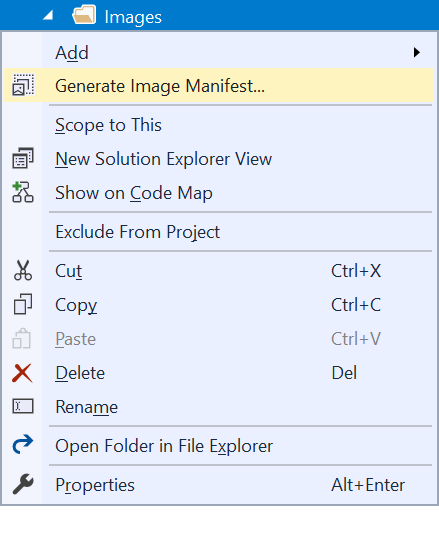

# Image Manifest Tools

[](https://ci.appveyor.com/project/madskristensen/monikermanifesttools)

Makes it easier to create and maintain .imagemanifest files for Visual Studio extension.

Download this extension from the [Marketplace](https://marketplace.visualstudio.com/items?itemName=MadsKristensen.KnownMonikersExplorer)
or get the [CI build](http://vsixgallery.com/extension/d5ed0bf3-4e8d-4199-b1ff-6c271e08bd0b/).

----------------------------------------------

> This tool wraps the *ManifestFromResources.exe* tool into an easy to use command.

## Generate Image Manifest

Right-click any folder and select "Generate Image Manifest...". This will take all .png and .xaml files and add them to an .imagemanifest file.



This will prompt to ask for a file name for the .imagemanifest file and then produce a file looking like this:

```xml
<?xml version="1.0" encoding="utf-8"?>
<!-- This file was generated by the ManifestFromResources tool.-->
<!-- Version: 14.0.50929.2 -->
<ImageManifest xmlns:xsi="http://www.w3.org/2001/XMLSchema-instance" xmlns:xsd="http://www.w3.org/2001/XMLSchema" xmlns="http://schemas.microsoft.com/VisualStudio/ImageManifestSchema/2014">
  <Symbols>
    <String Name="Resources" Value="/ConsoleApp3;Component/Images" />
    <Guid Name="MonikersGuid" Value="{8e97aaf4-e8c7-4076-af4a-d1ddc3ded81d}" />
    <ID Name="actionscript" Value="0" />
    <ID Name="ansible" Value="1" />
    <ID Name="apache" Value="2" />
    <ID Name="apigee" Value="3" />
  </Symbols>
  <Images>
    <Image Guid="$(MonikersGuid)" ID="$(actionscript)">
      <Source Uri="$(Resources)/actionscript.png">
        <Size Value="32" />
      </Source>
    </Image>
    <Image Guid="$(MonikersGuid)" ID="$(ansible)">
      <Source Uri="$(Resources)/ansible.png">
        <Size Value="32" />
      </Source>
    </Image>
    <Image Guid="$(MonikersGuid)" ID="$(apache)">
      <Source Uri="$(Resources)/apache.png">
        <Dimensions Width="33" Height="32" />
      </Source>
    </Image>
    <Image Guid="$(MonikersGuid)" ID="$(apigee)">
      <Source Uri="$(Resources)/apigee.png">
        <Dimensions Width="31" Height="32" />
      </Source>
    </Image>
  </Images>
  <ImageLists />
</ImageManifest>
```

When more image files have been added to the folder, simply repeat the steps and override the .imagemanifest file. This tool will first read the old .imagemanifest file in order to keep the existing IDs.

## License
[Apache 2.0](LICENSE)